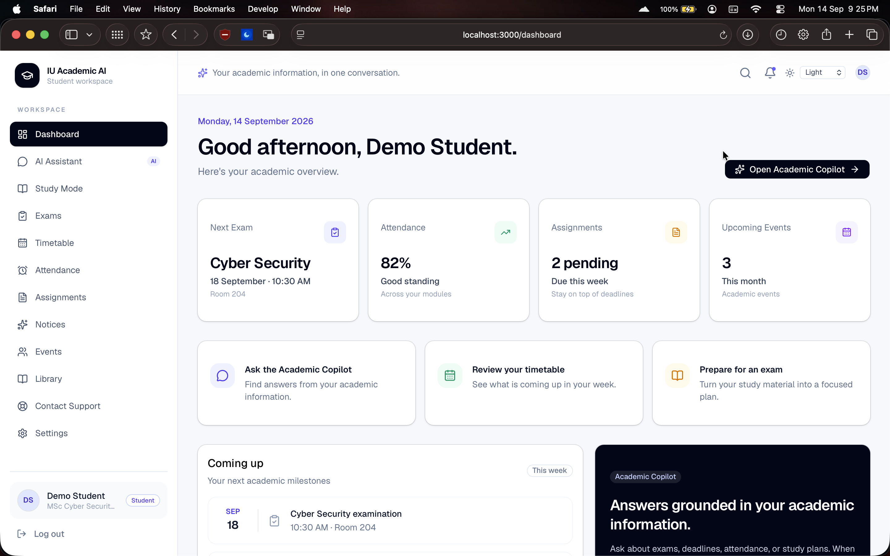
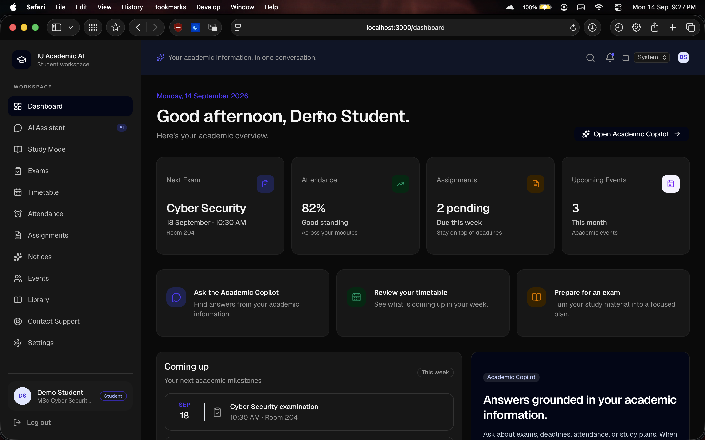

# IU Academic AI

> A student-first academic copilot for finding reliable university information,
> understanding study material, and taking the next academic action.

**Live demo:** [iu-academic-ai.vercel.app](https://iu-academic-ai.vercel.app)

To try the hosted prototype, open the live demo, select **Explore demo**, and
then choose **Continue with demo account**. The application is intentionally
labelled as a prototype and uses demonstration academic data.

## Overview

IU Academic AI is a student-focused Academic Copilot prototype. It brings
exams, timetable, attendance, assignments, notices, events, library guidance,
study tools, and grounded academic conversations into one workspace. Instead
of making students search across separate pages and policy documents, the
assistant turns a natural-language question into a useful answer with relevant
context, source information, and a clear next step.

This prototype was created for the **IU School AI Platform Development Team
selection task**.

## Problem Statement

Students often need to search across timetables, examination notices,
assignment instructions, attendance records, policies, and study material before
they can answer a simple academic question. Generic chatbots do not know which
information is authoritative and may confidently invent university-specific
details.

## Solution

IU Academic AI combines authenticated student data, a curated academic
knowledge base, intent detection, and a server-side LLM abstraction. The
assistant identifies the request type, retrieves relevant context, cites the
source when available, and clearly reports when reliable information cannot be
found.

The primary flow is:

```text
Login → Dashboard → Ask Academic AI → Retrieve context → Answer → Source → Action
```

## Features

### Student workspace

- **Dashboard:** A quick academic overview with upcoming exams, attendance,
  assignments, notices, and shortcuts to frequent tasks.
- **Exams:** Review upcoming assessments, dates, venues, subjects, and exam
  guidance in one place.
- **Timetable:** See the student's weekly schedule and move from a timetable
  item directly into an AI question.
- **Attendance:** Inspect subject-level attendance and identify areas that may
  need attention.
- **Assignments:** Track assignment status, deadlines, subjects, and available
  instructions.
- **Notices and events:** Keep university announcements, academic events, and
  important dates visible and easy to scan.
- **Library:** Browse library guidance and rules without searching through
  separate documents.
- **Settings and themes:** Manage the account experience with light, dark, and
  system theme options.

### AI-powered study and support

- **Academic Assistant (`/chat`):** Ask questions such as "When is my next
  exam?", "How much attendance do I have?", or "What are the library rules?"
  using normal language.
- **Context-aware answers:** The assistant classifies the request, retrieves
  relevant student or academic context, and produces a structured response
  instead of treating every question as a generic chat prompt.
- **Source-aware responses:** Answers can include source cards that point back
  to the relevant academic document or policy. Sources are shown only when the
  backend has source metadata.
- **Conversation history:** Create, rename, continue, and delete chat sessions
  so recurring questions remain organized.
- **Ask AI from modules:** Academic pages can pass the current context into the
  assistant, reducing the amount of information a student has to repeat.
- **AI Study Mode (`/study`):** Summarize material, explain difficult topics,
  and practise with interactive multiple-choice questions and scoring.
- **Support workflow:** Submit a support request when a question needs human
  follow-up or falls outside the assistant's supported scope.

### Product and engineering features

- Supabase email/password authentication with protected application routes.
- Student-specific queries based on the authenticated Supabase identity.
- Responsive application shell with accessible, reusable UI components.
- Server-side LLM abstraction compatible with OpenAI-style providers.
- Knowledge base with section-aware chunking and a pgvector-ready retrieval
  design.
- Request validation, sanitized errors, server-only provider credentials, and
  Supabase Row Level Security policies.
- Clearly labelled prototype data through `Prototype • Demo Academic Data`.

Demo content is intentionally labeled as demonstration information and must
not be treated as official university policy or records.

## Architecture

The project uses the Next.js App Router and keeps UI, API, AI, retrieval, and
data concerns separate:

```text
app/                 Pages and Route Handlers
components/          Reusable UI, layout, chat, study, and support components
data/                Replaceable demo data sources
lib/ai/              LLM provider, prompts, intent, and study services
lib/knowledge/       Document loading, chunking, and retrieval
lib/rag/             Retrieval and citation contracts
lib/services/        Shared authentication and API helpers
lib/supabase/        Browser and server Supabase clients
knowledge/           Demonstration academic documents
supabase/migrations/ PostgreSQL schema, pgvector, and RLS policies
```

The UI does not call an LLM provider directly. Browser requests go through
Next.js Route Handlers, which keep provider credentials on the server.

## Technology Stack

### Frontend

- Next.js 16 App Router
- React
- TypeScript
- Tailwind CSS
- shadcn/ui-compatible components
- Lucide React icons

### Backend

- Next.js Route Handlers
- Server-side TypeScript services
- Vercel-compatible deployment model

### Database and authentication

- Supabase Auth
- Supabase PostgreSQL
- PostgreSQL Row Level Security
- pgvector-compatible knowledge chunk storage

### AI

- Provider-neutral `LlmProvider` abstraction
- OpenAI-compatible server-side provider implementation
- Replaceable embedding provider interface

## AI Chatbot Use Case

The chatbot is the main interaction layer for the platform. It is designed for
the moments when a student knows what they need but does not know which module,
record, or policy document contains the answer.

For example, a student can ask:

```text
I have an exam next week. What do I need to carry, and where can I find the
latest examination rules?
```

The assistant can combine the student's upcoming exam information with the
retrieved examination guidance, answer in one conversation, and show the
supporting source. The same pattern works for attendance questions,
assignment deadlines, timetable checks, notices, library rules, and study
help.

The chatbot is intentionally more constrained than a general-purpose chatbot:

1. It identifies the intent, such as `exam`, `attendance`, `assignment`,
  `timetable`, `policy`, or `study help`.
2. It retrieves the smallest relevant set of student records and curated
  knowledge-base content.
3. It uses a centralized academic system prompt to keep responses useful and
  within the product's scope.
4. It returns the answer together with intent and source metadata.
5. It reports when reliable context is unavailable instead of presenting an
  unsupported answer as university fact.

This makes the assistant useful as a student navigation layer: it reduces
search time, connects related academic information, and helps students move
from a question to an action while keeping the boundary between demo data and
official university records clear.

## AI Architecture

The central AI contracts live in [`lib/ai/`](lib/ai):

1. Validate the incoming question.
2. Resolve the authenticated Supabase user.
3. Classify intent.
4. Retrieve student-specific and academic context.
5. Build the centralized academic system prompt.
6. Call the server-only LLM provider.
7. Return a structured response:

```json
{
  "message": "Your next exam is...",
  "sources": [
    {
      "title": "Examination Guidelines",
      "section": "Exam Requirements"
    }
  ],
  "intent": "exam"
}
```

The supported intent categories include exams, timetable, attendance,
assignments, notices, events, library, syllabus, academic policy, study help,
general academic, and unsupported requests.

## RAG Pipeline

The retrieval design is modular:

```text
Document
  → Text loading
  → Section-aware chunking
  → Embedding provider
  → Vector storage
  → Semantic search
  → Relevant context
  → LLM response
  → Source citation
```

The current demo uses a deterministic keyword retrieval fallback in
[`lib/knowledge/retrieval.ts`](lib/knowledge/retrieval.ts).
Supabase pgvector contracts and migration support are available for semantic
retrieval when embeddings and database infrastructure are configured.

Documents currently live in [`knowledge/`](knowledge):

- Exam guidelines
- Examination rules
- Attendance policy
- Library rules
- Assignment policy
- Academic calendar

The assistant does not fabricate citations. A source card is only rendered
when the backend returns source metadata.

## Database Schema

The Supabase migrations define:

- `students`
- `subjects`
- `exams`
- `timetable`
- `attendance`
- `assignments`
- `notices`
- `events`
- `library_items`
- `knowledge_documents`
- `knowledge_chunks`
- `chat_sessions`
- `chat_messages`
- `support_requests`

The academic schema is in
[`supabase/migrations/20260914171200_academic_schema.sql`](supabase/migrations/20260914171200_academic_schema.sql).

## Authentication

Supabase Auth manages student sessions. The Next.js `proxy.ts` refreshes and
checks sessions at the application boundary:

- Public landing page: `/`
- Login page: `/login`
- Protected student routes: dashboard, chat, study, modules, settings, and support
- Authenticated users visiting `/login` or `/` are redirected to `/dashboard`
- Unauthenticated users visiting protected routes are redirected to `/login`

Student-specific queries use the authenticated Supabase identity rather than
trusting a `student_id` supplied by the browser.

## Security

- LLM keys are server-only environment variables.
- Browser code communicates with application Route Handlers, not the LLM.
- Request bodies are validated before processing.
- Supabase RLS protects student profiles, attendance, assignments, chat history,
  and support requests.
- Public academic data has authenticated read policies where appropriate.
- Technical failures are logged server-side and sanitized for users.
- Demo passwords are never stored in source code.
- Demo data is clearly labeled and is not presented as official university data.

## Installation

Requirements:

- Node.js 20 or newer
- npm
- A Supabase project for authentication and database features
- An OpenAI-compatible LLM provider for live AI responses

Install dependencies:

```bash
npm install
```

Create a `.env.local` file in the project root and provide the variables below.

Apply the SQL files in `supabase/migrations/` to the Supabase project. Enable
the `vector` extension if pgvector retrieval is being used.

## Environment Variables

```env
NEXT_PUBLIC_SUPABASE_URL=
NEXT_PUBLIC_SUPABASE_ANON_KEY=

# Server-only. Never expose these with NEXT_PUBLIC_.
LLM_API_KEY=
LLM_MODEL=
LLM_BASE_URL=https://api.openai.com/v1

# Server-only demo account configured in Supabase Auth.
DEMO_STUDENT_EMAIL=
DEMO_STUDENT_PASSWORD=
```

Never commit `.env.local` or provider secrets.

## Running Locally

Start the development server:

```bash
npm run dev
```

Open [http://localhost:3000](http://localhost:3000).

Useful checks:

```bash
npm run lint
npm run build
```

## Demo Account

Create a student user in Supabase Auth, then configure its credentials through:

```env
DEMO_STUDENT_EMAIL=
DEMO_STUDENT_PASSWORD=
```

Use the **Continue with demo account** button on `/login`. The credentials are
not embedded in the application.

The interface identifies its records as demo data through the footer label:

> Prototype • Demo Academic Data

## Screenshots

### Main dashboard

The dashboard brings the student's most important academic signals into one
view: upcoming exams, attendance, assignments, notices, and quick actions.



### AI dashboard and assistant

The AI-focused view makes conversational academic support the primary workflow,
with chat history and contextual answers available alongside the rest of the
student workspace.


### Dark theme dashboard

The same workspace is available in a dark theme for students who prefer a lower
brightness interface.



## Future Improvements

- Connect every module to Supabase queries instead of demo data.
- Add production document ingestion and PDF text extraction.
- Generate and persist embeddings for all knowledge chunks.
- Replace keyword fallback with pgvector semantic search.
- Add streaming LLM responses.
- Add rate limiting and abuse monitoring for chat endpoints.
- Add server-side preference persistence.
- Add richer citation page/paragraph metadata.
- Add faculty and admin roles after the student experience is complete.

## Limitations

- Academic records are demonstration data.
- The keyword retriever is not a substitute for production semantic search.
- The MCQ bank is a small curated prototype set.
- Some controls, such as library catalogue search and notifications, are
  visual prototype interactions.
- A configured Supabase project and LLM provider are required for live
  authenticated AI requests.
- The prototype does not claim official university policies, dates, venues,
  thresholds, or notices.

## Author

IU Academic AI was created as a prototype for the **IU School AI Platform
Development Team selection task**.
